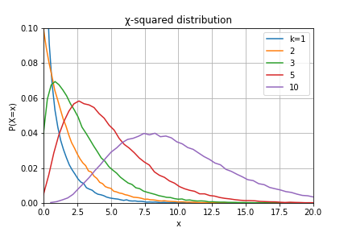

## $\chi^2$分布

$Z \sim N(0,1)$で，自由度$k$の$\chi^2 = \sum^k_i Z^2_i$が従う確率分布．

### $\chi^2$分布の性質

- 期待値は$k$，分散は$2k$となる．  
- 正規分布と同じく，再生性を持つ．  
$X_1 \sim\chi^2(k_1), \quad X_2 \sim\chi^2(k_2) \quad \to \quad  X_1+X_2 \sim \chi^2(k_1+k_2)$  
- $X_i$が独立に$N(\mu, \sigma^2)$に従うとき，正規化と2乗された$X_i$の$k$個の合計は，自由度$k$の$\chi^2$分布に従う．  
$\sum^k_i (\frac{X_i-\mu}{\sigma})^2 \quad \sim \quad  \chi^2(k)$  
展開すると，標本平均$\bar{X}$と不偏分散$S$を用いて次のように表される．
$\sum^k_i (\frac{X_i-\bar{X}}{\sigma})^2 \quad = \quad \frac{(k-1)S^2}{\sigma^2} \quad \sim \quad \chi^2(k-1)$
- $\chi^2$分布 $(k=2) \quad \equiv \quad$ 指数分布$(\lambda=\frac{1}{2})$

## 母分散の95%信頼区間の求め方  

1. 普遍分散$s^2$を求める．  
$$s^2 = \frac{1}{n-1} \sum^{n}_{i}(x_i - \bar{x})^2$$
2. 自由度$n-1$の$\chi^2$分布の上側2.5%点と下側2.5%点を参照する($\chi^2$分布は左右非対称)．
3. 信頼区間は次のように求められる．
$$\frac{(n-1)s^2}{\chi^2_{upper} (n-1)} \leq \sigma^2 \leq \frac{(n-1)s^2}{\chi^2_{lower} (n-1)}$$